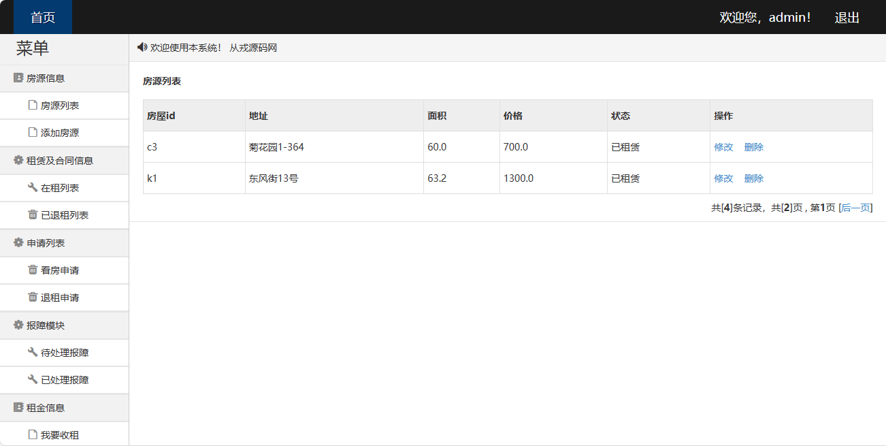
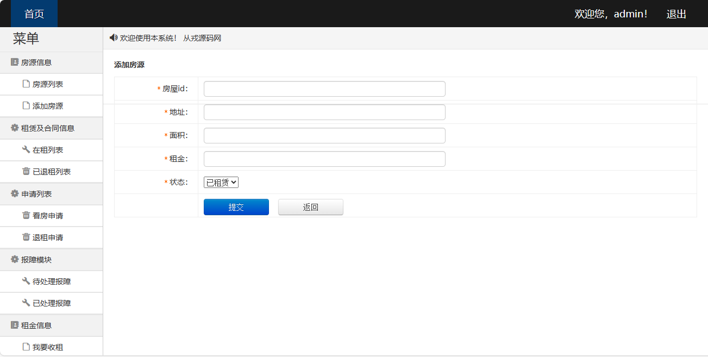
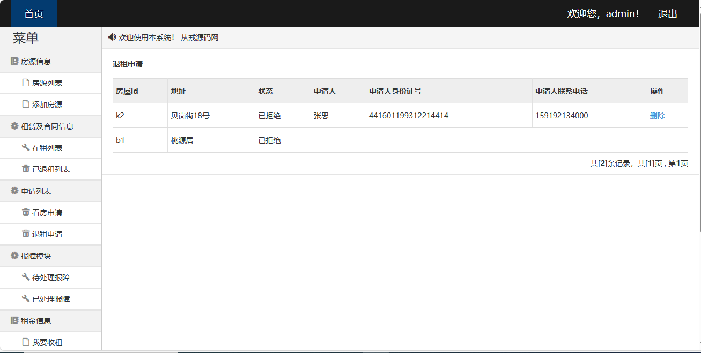
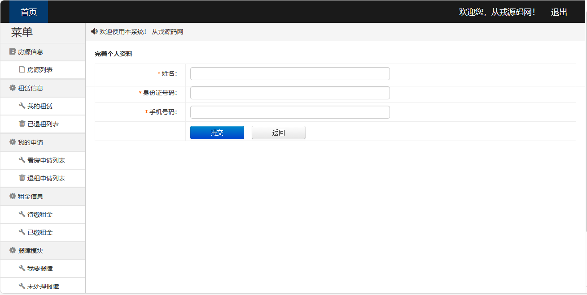

<h1 align="center">43.基于ssm的房屋租赁管理系统</h1>

 获取sql文件 QQ: 386869957 QQ群: 377586148 

 [推荐站点: 从戎源码网](https://armycodes.com/) 

## 简介

> 本代码来源于网络,仅供学习参考使用!
>
> 提供1.远程部署/2.修改代码/3.设计文档指导/4.框架代码讲解等服务
>
> 用户登录地址：http://localhost:8080/text2/login.action
>
> 用户名：从戎源码网   密码: 1
>
> 管理员: admin   密码: 123456

> 基于ssm的房屋租赁管理系统
> 功能介绍
> 房源信息模块：
> 房源信息展示、房源信息更新、房源信息增加、房源信息删除
> 账户管理模块：
> 账户登录、账户绑定、账户管理
> 租金结算模块：
> 每月租金信息、租金交付功能、月租金收入总额统计
> 房屋租赁合同管理模块：
> 房屋租赁合同录入、房屋租赁合同展示、房屋租赁价格修改、房屋租赁合同终止
> 报障模块：
> 租客报账、管理员报障审核、租客报障统计
> 日程模块：
> 收租日程显示
> 项目介绍
> 框架：
> 项目整体采用spring+springMVC+mybatis框架

数据库：
使用mysql数据库

服务器：
Tomcat服务器部署

## 环境

- <b>IntelliJ IDEA 2009.3</b>
- <b>Mysql 5.7.26</b>
- <b>Tomcat 7.0.73</b>
- <b>JDK 1.8</b>

## 运行截图

